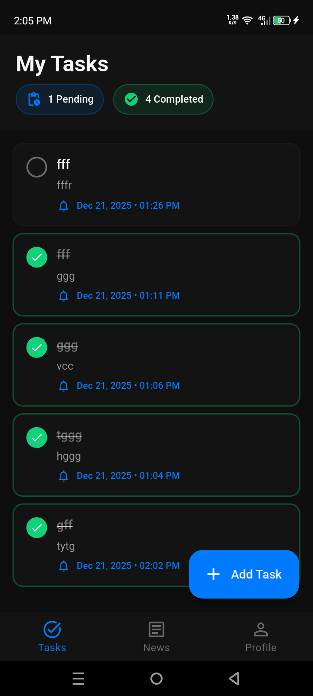
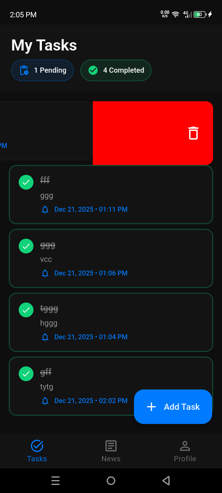
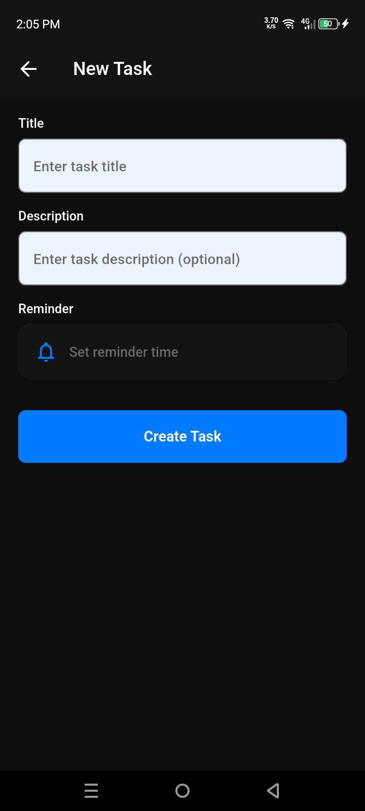
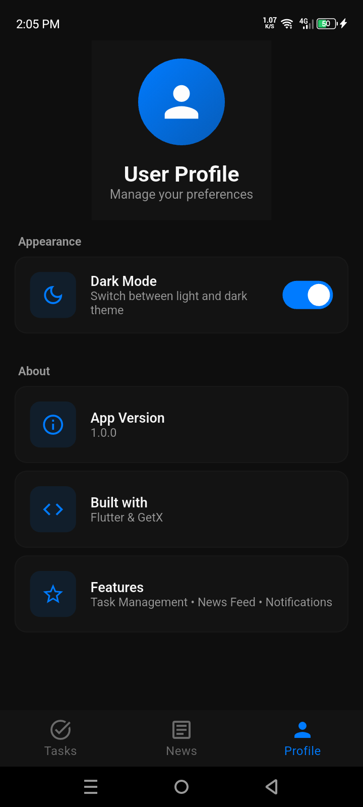

# Task Management & News Feed App

A professional Flutter application featuring task management with reminders, news feed integration, and customizable themes. Built with GetX state management following clean architecture principles.

## Features

### ✅ Task Management
- Create, read, update, and delete tasks
- Mark tasks as complete/incomplete with visual indicators
- Set reminders with local notifications
- Swipe-to-delete functionality
- Task statistics (pending/completed counts)
- Persistent storage using GetStorage

### 📰 News Feed
- Integration with News API for latest headlines
- Beautiful card-based news display with images
- Pull-to-refresh functionality
- Skeleton loading states
- Detailed news view with share functionality
- Open articles in external browser

### 🎨 Themes & UI
- Professional dark/light theme support
- Smooth theme transitions with persistence
- Modern Material 3 design
- Gradient backgrounds and shadows
- Responsive layouts
- Empty states and error handling

### 🔔 Notifications
- Local notifications for task reminders
- Schedule notifications for future tasks
- Automatic notification cancellation on task completion

## Screenshots

Below are app screenshots (images are located in the `screen_shots/` folder):










## Getting Started

### Prerequisites
- Flutter SDK (3.9.0 or higher)
- Dart SDK
- Android Studio / VS Code with Flutter extensions
- A News API key (free tier available at https://newsapi.org)

### Installation

1. **Clone the repository**
   ```bash
   git clone <repository-url>
   cd assignment_btf
   ```

2. **Install dependencies**
   ```bash
   flutter pub get
   ```

3. **Configure News API**
   - Get your free API key from [News API](https://newsapi.org)
   - Open `lib/constant/api_constant.dart`
   - Replace `YOUR_NEWS_API_KEY_HERE` with your actual API key:
   ```dart
   final String newsApiKey = "your_actual_api_key_here";
   ```

4. **Run the app**
   ```bash
   flutter run
   ```

## Project Structure

```
lib/
├── constant/           # App constants (colors, themes, API config)
├── controllers/        # GetX controllers for state management
│   ├── task_controller.dart
│   ├── news_controller.dart
│   └── theme_controller.dart
├── models/            # Data models
│   ├── task_model.dart
│   └── news_model.dart
├── screens/           # UI screens
│   ├── main_navigation/
│   ├── tasks/
│   ├── news/
│   └── profile/
├── services/          # Services layer
│   ├── api/
│   ├── notification/
│   └── storage_services/
├── widgets/           # Reusable widgets
│   ├── cards/
│   ├── empty_state/
│   ├── buttons/
│   └── texts/
└── main.dart          # App entry point
```

## Architecture

The app follows **Clean Architecture** principles with clear separation of concerns:

- **Models**: Data structures and business logic
- **Services**: API calls, storage, and notifications
- **Controllers**: GetX state management with reactive programming
- **Screens**: UI layer with Obx for reactive updates
- **Widgets**: Reusable UI components

## State Management

Uses **GetX** for reactive state management:
- `RxList` for reactive lists (tasks, news articles)
- `RxBool` for loading states
- `Rx<ThemeMode>` for theme management
- `Obx` widgets for automatic UI updates

## Key Dependencies

- **get**: State management and routing
- **get_storage**: Local data persistence
- **flutter_local_notifications**: Task reminders
- **dio**: HTTP client for API calls
- **url_launcher**: Open news articles in browser
- **share_plus**: Share news articles
- **skeletonizer**: Loading skeletons
- **intl**: Date formatting

## Usage

### Adding a Task
1. Navigate to Tasks tab
2. Tap the floating action button (+)
3. Enter task title and description
4. Optionally set a reminder time
5. Tap "Create Task"

### Setting Reminders
- When creating/editing a task, tap the reminder field
- Select date and time
- Notification will appear at the scheduled time

### Viewing News
1. Navigate to News tab
2. Pull down to refresh articles
3. Tap any article to view details
4. Share or open in browser from detail screen

### Switching Themes
1. Navigate to Profile tab
2. Toggle the Dark Mode switch
3. Theme preference is saved automatically

## Features Implemented

✅ Task CRUD operations with local storage
✅ Task completion toggle with visual feedback
✅ Task reminders with local notifications
✅ News API integration with error handling
✅ Pull-to-refresh for news feed
✅ Dark/Light theme with persistence
✅ Tab-based navigation
✅ Professional UI with gradients and shadows
✅ Empty states and loading skeletons
✅ Share functionality for news articles
✅ Swipe-to-delete for tasks

## Notes

- **News API**: The free tier has rate limits. If you see errors, check your API key and usage limits.
- **Notifications**: On iOS, you may need to grant notification permissions when prompted.
- **Theme**: Theme preference persists across app restarts.
- **Tasks**: All tasks are stored locally and persist across app restarts.

## Troubleshooting

### News not loading
- Verify your API key is correct in `api_constant.dart`
- Check your internet connection
- Ensure you haven't exceeded News API rate limits

### Notifications not working
- Grant notification permissions when prompted
- Check device notification settings
- Ensure reminder time is in the future


## Author

Built with ❤️ using Flutter and GetX
